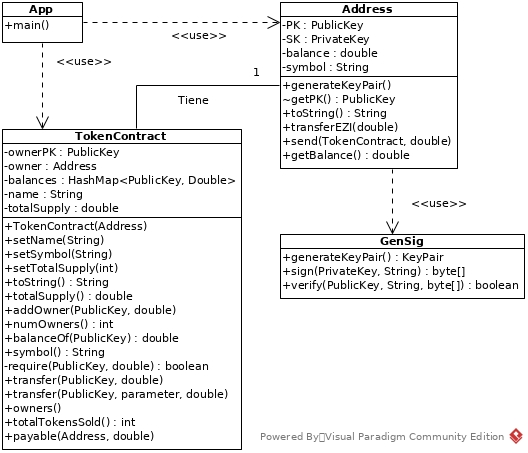

# Proyecto EnZinium

Proyecto sobre un examen de años anteriores.

El programa trata sobre la administración de contratos inteligentes que son capaces de saber quienes tienen las entradas en todo momento y el dinero ganado.

El programa esta basado en el universo de Rick y Morty.

La clase GenSig ha sido proporcionada por nuestro tutor.

## Diagrama de clases

## Historias de usuario

Historia de usuario | Rol | Objetivo | Porque
--- | --- | --- | ---
1 | Programa | Asignar claves a los clientes | Para poder identificarlos
2 | Dueño del contrato | Crear el contrato | Para poder vender las entradas del concierto
3 | Dueño del contrato | Añadir propietario | Para asignar los tokens a cada persona
4 | Dueño del contrato | Consultar balances | Para saber quienes tienen entradas
5| Dueño del contrato | Transferir tokens | Para vender las entradas
6 | Cualquier propietario de tokens | Transferir tokens | Para poder revender las entradas
7 | Comprador de tokens | Comprar tokens usando EZIs | Para poder pagar usando EZIs

###### Desarrollado por José María Samos Diago